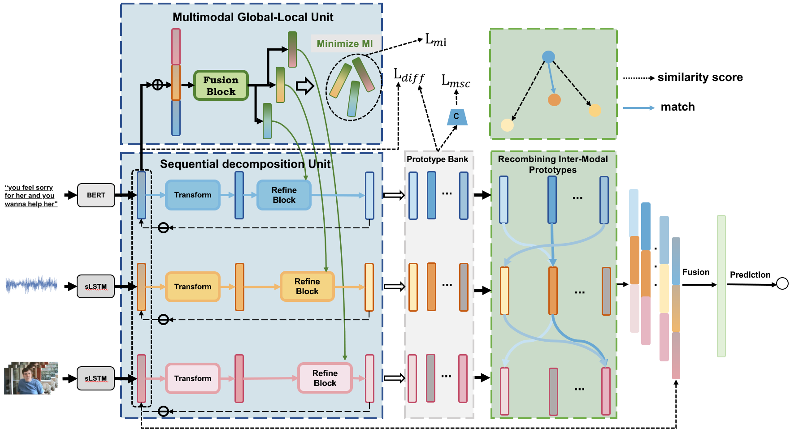

# GUIDED CIRCULAR DECOMPOSITION AND CROSS-MODAL RECOMBINATION FOR MULTIMODAL SENTIMENT ANALYSIS


We propose Guided Circular Decomposition and Cross-Modal Recombination (GCD-CMR) network to reduce the contamination of modal sentiment features.
## The Framework of GCD-CMR.


## Usage

### Prerequisites
- Python 3.8
- PyTorch 1.6.0
- CUDA 10.2

### Run the Codes
First, you need to change the data folder path in the `./config.json`. 

Then ,you can train the model as below:
```
python run.py
```


